

# Analog IC Design & Layout Projects
### 基于 Cadence Virtuoso 的定制化模拟电路设计与后仿真实验

**从理论计算到硅后验证：涵盖 Cascode 增益级与两级运算放大器全流程设计** 

Full Flow Practice: Theoretical Calculation → Schematic → Pre-Sim → Layout → DRC/LVS → Post-Sim

---

## 项目亮点 (Highlights)

- **完整闭环验证**：遵循工业级 EDA 设计流程，包含前仿真、版图物理设计及提取寄生参数后的后仿真（Post-Layout Simulation）。
- **深亚微米设计**：基于 0.18μm 工艺节点，深入探讨短沟道效应对增益和带宽的影响。
- **性能驱动设计**：针对特定指标（如 70dB 增益、150MHz 带宽）进行多次参数迭代优化。
- **版图艺术**：注重模拟电路中的**器件匹配（Matching）**、**寄生电容控制**与**LVS 一致性检查**。

## 实验环境 (Design Environment)
- **工艺库**：Generic 0.18μm CMOS Process
- **核心工具链**：
  - **Cadence Virtuoso**: 原理图输入与版图编辑 (Composer & Layout XL)
  - **Spectre**: 高精度电路仿真
  - **PVS / Calibre**: 物理验证 (DRC 规则检查 & LVS 一致性检查)
- **验证项**：DC Sweep, AC Analysis, Transient Analysis, Parasitic Extraction (PEX)

---

## 🛠 实验一：Cascode 放大器设计与负载特性分析 (Cascode Amplifier)

本实验探讨了共源共栅（Cascode）结构在高增益应用中的表现，重点分析了负载电阻 $R_D$ 对输出摆幅与电压增益的非线性影响。

### 1. 设计规范 (Specifications)
- **器件规模**： $(W/L)_{1,2} = 50\mu\text{m} / 0.18\mu\text{m}$
- **工作电压**： $V_{DD} = 3.3V$
- **偏置条件**： $V_b = 2.1V$

### 2. 仿真与物理实现

展开查看详细结果

  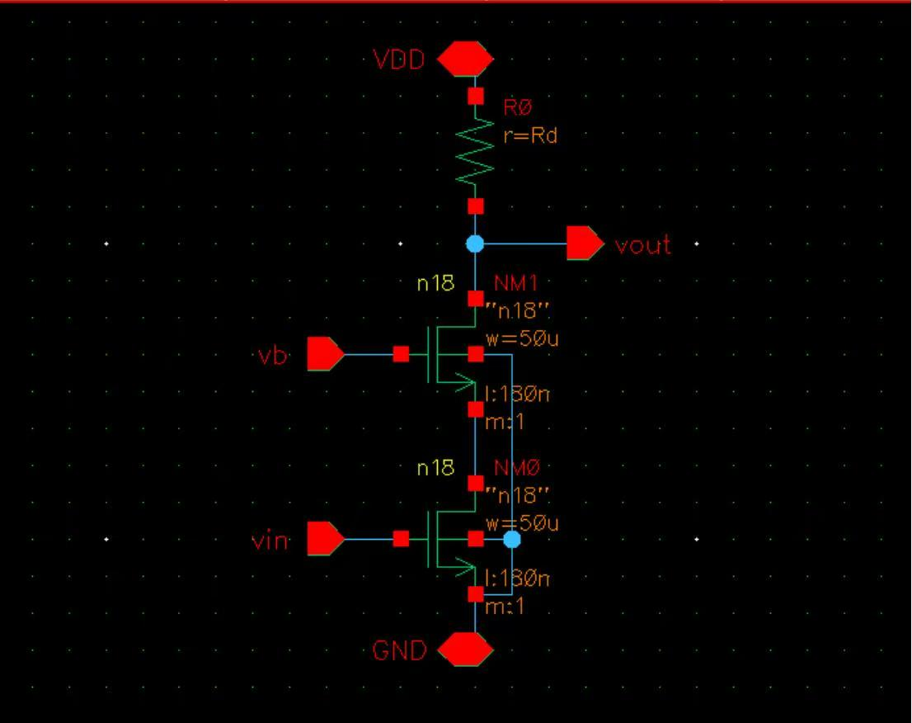
  
<i>图 1.1: Cascode 放大器原理图与仿真平台</i>

  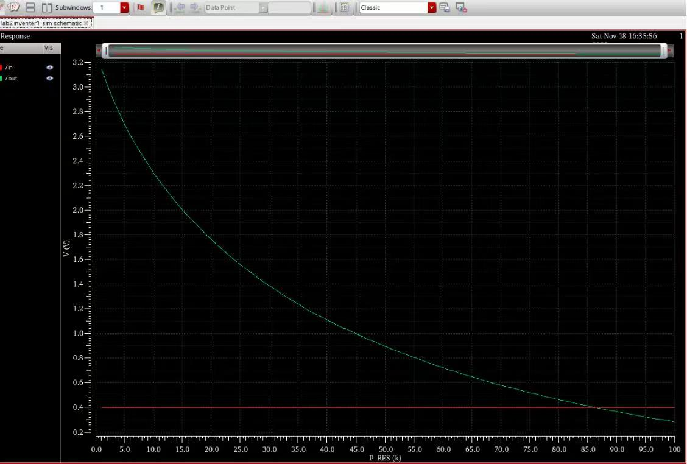
  
<i>图 1.2: 增益随负载电阻 $R_D$ 变化的扫描曲线 (1k - 100k)</i>

  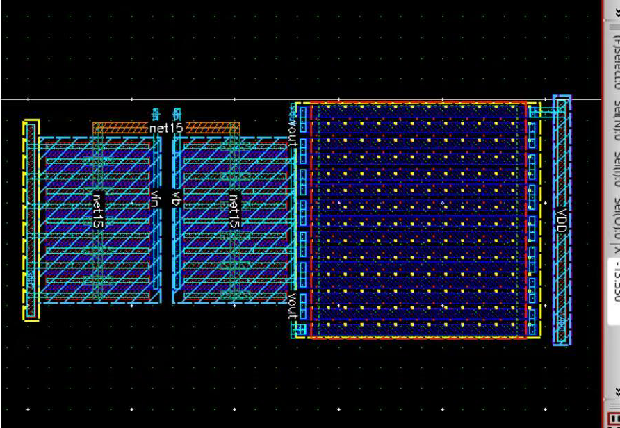
  
<i>图 1.3: $R_D=100k\Omega$ 时的物理版图设计</i>

  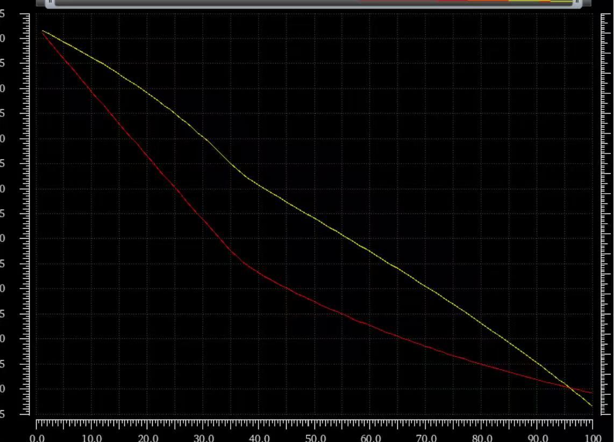
  
<i>图 1.4: 提取寄生参数后的输出波形验证</i>

---

## 💎 实验二：高增益两级运算放大器 (Two-Stage Op-Amp Design)

设计并实现了一个满足高性能指标的补偿型两级运算放大器，重点解决增益带宽积（GBW）与相位裕度（PM）的平衡问题。
- **第一级 (Gain Stage)**：采用五管差分对结构，提供核心电压增益，并利用电流镜负载提高输出阻抗。
- **第二级 (Output Stage)**：共源级放大，旨在扩大输出电压摆幅并增强驱动能力。
- **补偿网络**：引入 Miller 补偿电容实现极点劈裂，确保闭环稳定性。

### 1. 设计指标与达成情况 (Performance Metrics)

| 参数 (Parameters) | 目标指标 (Target) | 仿真结果 (Result) | 结论 (Status) |
| :--- | :--- | :--- | :--- |
| **电压增益 ($A_v$)** | $\ge 70\text{ dB}$ | **72.23 dB** | ✅ Pass |
| **单位增益带宽 ($f_{u}$)** | $\ge 150\text{ MHz}$ | **158.4 MHz** | ✅ Pass |
| **压摆率 (SR)** | $\ge 10\text{ V/μs}$ | **12.5 V/μs** | ✅ Pass |
| **共模输入范围 (ICMR)** | $-1.5\text{V} \sim 2\text{V}$ | 满足要求 | ✅ Pass |
| **功耗 ($P_{diss}$)** | $\le 10\text{ mW}$ | **低功耗设计** | ✅ Pass |
| **相位裕度 (PM)** | $> 45^\circ$ | **稳定** | ✅ Pass |

### 2. 核心设计细节

展开查看设计全过程

  
### 2.1 原理图输入 (Schematic Input)

在 Virtuoso 编辑器中完成两级运放的核心拓扑搭建。第一级为差分输入级，第二级为共源放大级，并加入 Miller 补偿电容。

  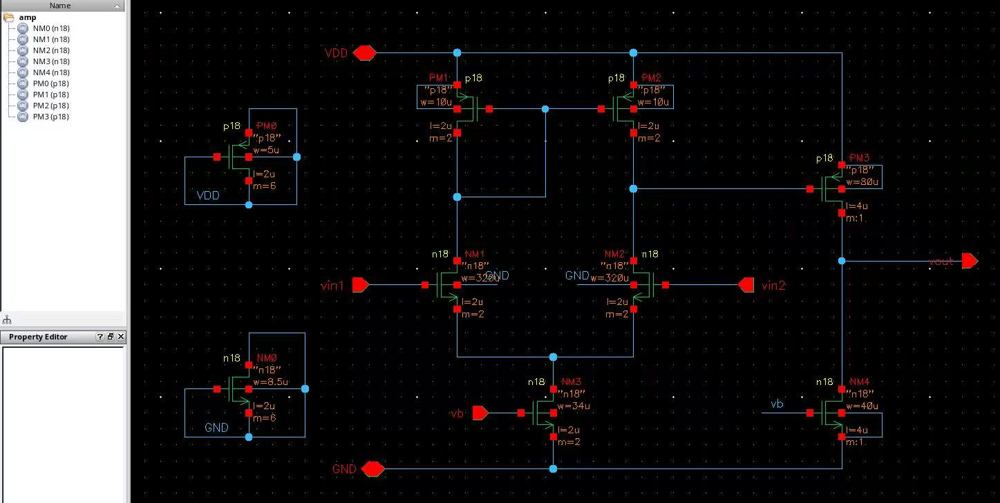
  
<i>图 2.1 两级运放核心电路原理图</i>

### 2.2 仿真原理图 (Simulation Testbench)

搭建包含偏置电流源、负载电容及输入激励的完整测试平台（Testbench），确保各引脚连接正确。

  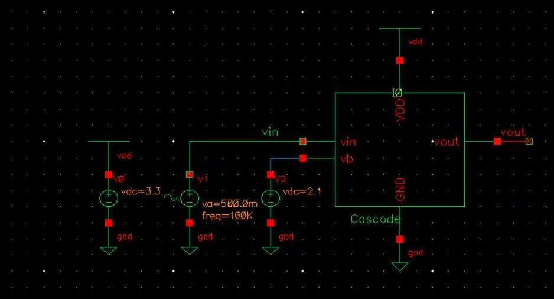
  
<i>图 2.2 交流特性仿真测试平台</i>

### 2.3 前仿真 (Pre-layout Simulation)

执行 AC 分析验证频率特性。仿真结果显示电压增益为 **72.23 dB**，相位裕度稳定，各项交流指标均达到设计要求。

  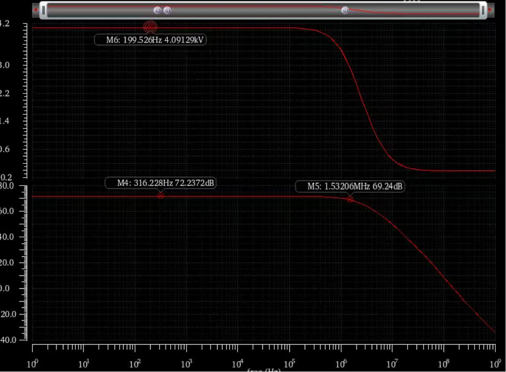
  
<i>图 2.3 前仿真开环增益与相位频率特性</i>

### 2.4 版图设计 (Layout Design)

遵循模拟版图布局原则，对差分对管进行匹配处理，并进行合理的 Guard Ring 布局以抑制噪声。

  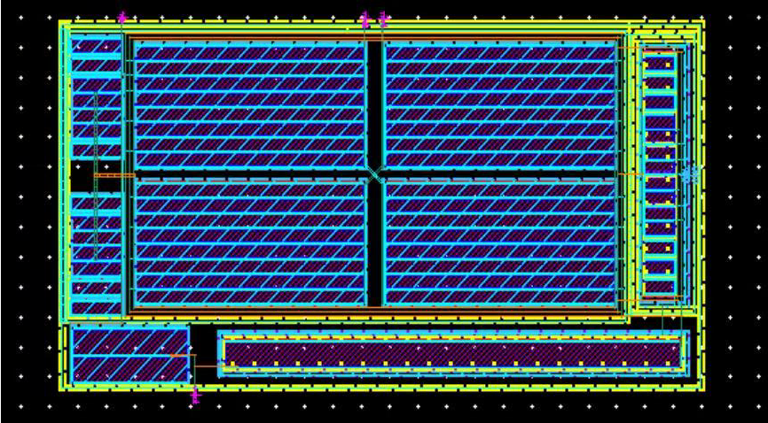
  
<i>图 2.4 两级运放物理版图实现</i>

### 2.5 物理验证 (DRC & LVS)

通过 DRC 规则检查（无违反工艺规则）与 LVS 一致性检查（原理图与版图网表完全匹配）。

  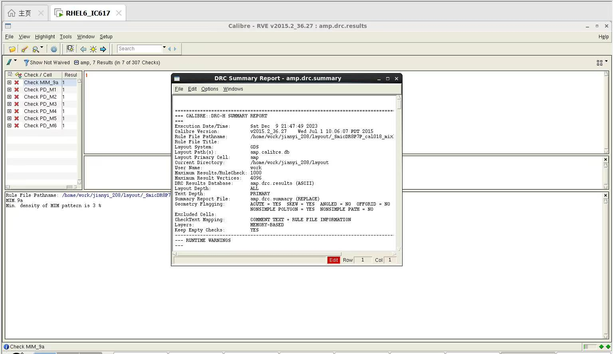
  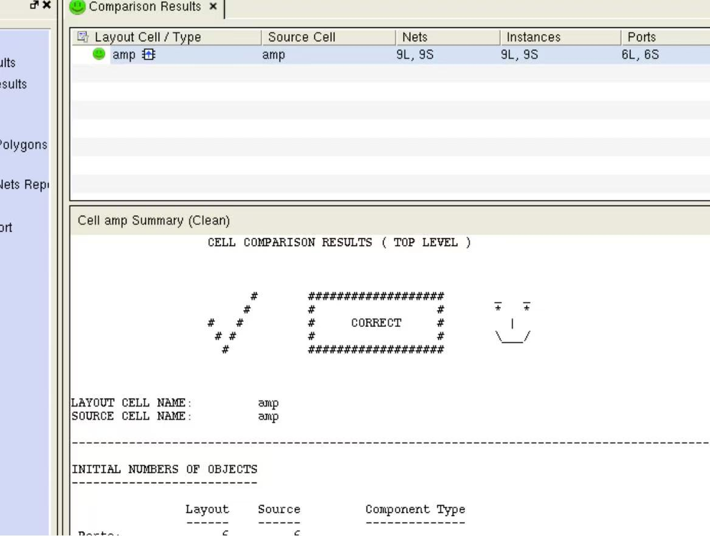
  
<i>图 2.5 DRC 与 LVS 验证结果（均 Clean）</i>

### 2.6 后仿真 (Post-layout Simulation)

通过 PEX 提取寄生电容和电阻，验证物理版图对电路性能的实际影响，确保后仿真结果依然满足流片指标。

  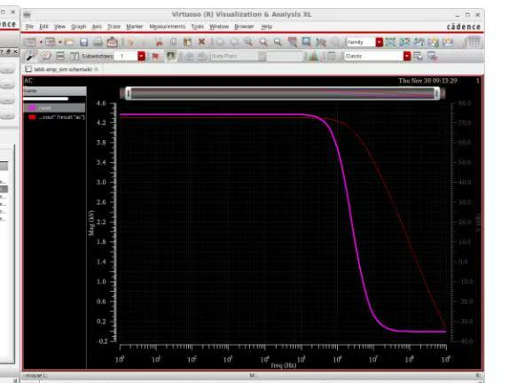
  
<i>图 2.6 后仿真（寄生提取后）开环增益与相位频率特性</i>

---

## 总结与感悟 (Lessons Learned)

### 1. 模拟设计的权衡 (The Art of Trade-off)
在两级运放的设计中，深刻体会到 **"Analog Design Hexagon"**。例如，为了提高增益，我们需要增大第一级负载管的输出电阻，但这往往会引入更大的寄生电容，从而导致单位增益带宽下降。通过多次迭代计算 $(W/L)$，我学会了如何在功耗、面积与速度之间寻找折中点。

### 2. 版图即电路 (Layout is Circuit)
版图设计并非简单的连线。在 **Cascode 放大器** 的后仿真中，我观察到：
- **寄生效应的影响**：未优化的布线会导致增益在低频段出现微弱下滑。
- **匹配的重要性**：差分对管必须严格遵循共重心或对称布局，否则输入失调电压（Offset）将直接摧毁高精度系统的性能。

### 3. 物理验证的严谨性
完成 **DRC (Design Rule Check)** 和 **LVS (Layout Vs Schematic)** 是芯片设计的底线。看到 "Netlists Match" 的一瞬间，才真正意味着电路具备了流片的基本资格。

---
